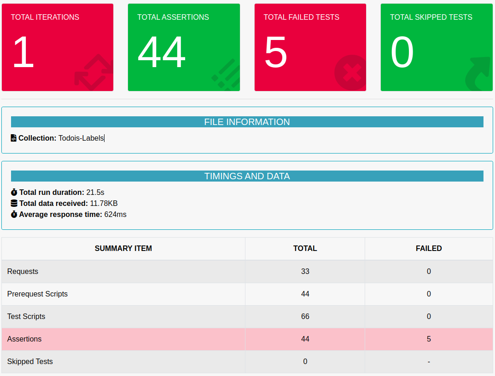
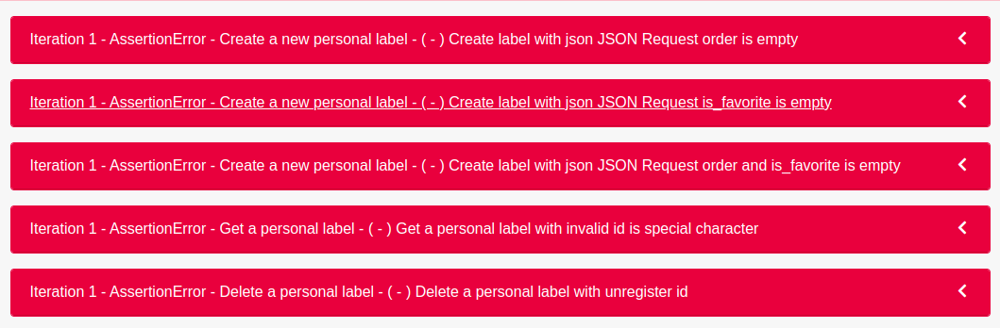

## Postman Automation Test Todois Labels

Repo that contains the Rest API test using Postman. test includes the positive case and negative case types in the Rest API functionality

## Test Case Documentation

To access the test case documentation you can access the link below.
```link 
https://bit.ly/DocumentationTodoisLabelsTesting
``` 

## Set up

Once you have downloaded or cloned the repo you need to install the dependencies for the API. We do this using `npm`.

```cli
npm install
```

This command will read the package.json file and install all the required dependencies, such as, `express`, `bcrypt`, and `jsonwebtoken`.

---

## Structure Folder

```
Todos
  |----- Create a new personal label
  |----- Get all personal label
  |----- Get a personal label
  |----- Update a personal label
  |----- Delete a personal label
```
---
## Tokens

In order to make authorized calls to the REST API, your application must provide an authorization header with the appropriate Bearer $token. For working through the examples, you can obtain your personal API token from the integrations settings for your account.

```js
-H "Authorization: Bearer $token"
```

---

##  Routes

### Get all personal labels

Returns a JSON-encoded array containing all user labels. A successful response has 200 OK status and application/json Content-Type.

**GET** `https://api.todoist.com/rest/v2/labels`

Sample **Response**:

```json
[
  {
    "id": "2165445028",
    "name": "Raegan",
    "order": 266,
    "color": "red",
    "is_favorite": false
  },
  {
    "id": "2165445638",
    "name": "Drinks",
    "order": 0,
    "color": "red",
    "is_favorite": false
  }
]
```
---
### Create a new personal label

Creates a new personal label and returns its object as JSON. A successful response has 200 OK status and application/json Content-Type.

**POST** `https://api.todoist.com/rest/v2/labels`

Body of **request** must be JSON. Sample:

```json
{
  "name": "Madilyn",
  "order": 381,
  "color": "red",
  "is_favorite": false
}
```

Response **Error**:

All the errors from the server should return as valid JSON data. They will have an HTTP status code of 400. Sample:

```json
Color format is not valid
```
---

### Get a personal label

Returns a personal label by ID. A successful response has 200 OK status and application/json Content-Type.

**GET** `https://api.todoist.com/rest/v2/labels/2165445638"`

Body of **request** must be JSON. Sample:

```json
{
  "id": "2165445638",
  "name": "Drinks",
  "order": 0,
  "color": "red",
  "is_favorite": false
}
```

Response **Error**:

All the errors from the server should return as valid JSON data. They will have an HTTP status code of 404. Sample:

```json
Label not found
```
---
### Update a personal label

Returns the updated label. A successful response has 200 OK status and application/json Content-Type.

**POST** `https://api.todoist.com/rest/v2/labels/2156154810`

Body of **request** must be JSON. Sample:

```json
{
  "id" : 2156154810,
  "name": "Madilyn",
  "order": 381,
  "color": "red",
  "is_favorite": false
}
```

Response **Error**:

All the errors from the server should return as valid JSON data. They will have an HTTP status code of 400. Sample:

```json
Color format is not valid
```
---
### Delete a personal label

Deletes a personal label, all instances of the label will be removed from tasks,  successful response has 204 No Content status and an empty body.

**DELETE** `https://api.todoist.com/rest/v2/labels/2156154810`

Response **Error**:

All the errors from the server should return as valid JSON data. They will have an HTTP status code of 404. Sample:


```json
label_id is invalid
```
## Report by Newman Run Dashboard




SHOWING 5 **FAILURES**

